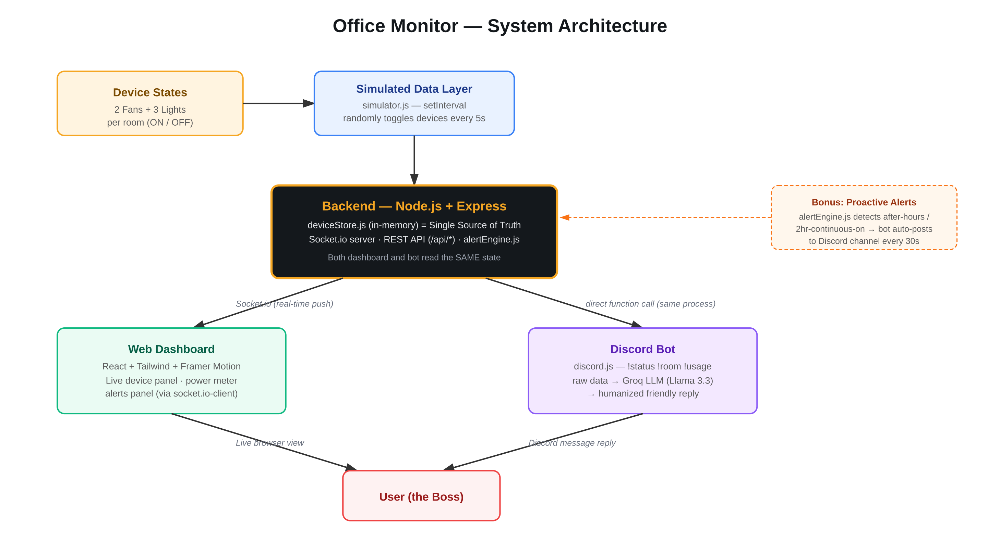

# Office Monitor

A real-time office electrical monitoring system — a live web dashboard and a Discord bot, both backed by a single shared Node.js backend.




## What it does

- Tracks 15 simulated devices (2 fans + 3 lights × 3 rooms: Drawing Room, Work Room 1, Work Room 2)
- Live web dashboard — updates in real time via Socket.io, no page refresh
- Discord bot (`!status`, `!room <name>`, `!usage`) that reads from the **same backend** as the dashboard and replies in natural language via a Groq-hosted LLM
- Alert engine — flags devices left on after office hours (9 AM–5 PM) or rooms with everything on for 2+ continuous hours, shown on the dashboard and optionally pushed proactively to Discord

## Tech Stack

| Layer | Tech |
|---|---|
| Backend | Node.js, Express, Socket.io |
| Frontend | React (Vite), Tailwind CSS v4, Framer Motion |
| Discord Bot | discord.js |
| LLM (humanized replies) | Groq SDK (Llama 3.3 70B) |
| Data | In-memory store (no DB needed — this is a live demo, not a persistent system) |
| Hardware concept | ESP32 simulated in Wokwi |

## Architecture

```
Device States → Simulated Data Layer (simulator.js, setInterval)
             → Backend (Express + Socket.io) — single source of truth
             → [Web Dashboard] + [Discord Bot]
             → User
```

Both the dashboard and the Discord bot read from the exact same in-memory `deviceStore.js` in the same Node.js process — there is only one source of truth, per the architecture requirement. See `diagrams/system-diagram.svg` for the full diagram.

## Setup & Running Locally

### Prerequisites
- Node.js 18+
- A Discord bot token ([discord.com/developers/applications](https://discord.com/developers/applications))
- A free Groq API key ([console.groq.com](https://console.groq.com))

### 1. Backend

```bash
cd backend
npm install
cp .env.example .env
# fill in DISCORD_TOKEN, GROQ_API_KEY, ALERT_CHANNEL_ID in .env
npm run dev
```

Runs on `http://localhost:4000`. If `DISCORD_TOKEN` is missing or invalid, the bot simply stays disabled — the API and dashboard still work fine.

### 2. Frontend

```bash
cd frontend
npm install
cp .env.example .env
# VITE_BACKEND_URL should point to your backend (default: http://localhost:4000)
npm run dev
```

Open `http://localhost:5173`.

### 3. Discord Bot

Starts automatically with the backend (same process, same source of truth). To invite the bot to your server: Developer Portal → your app → OAuth2 → URL Generator → scope `bot` → permissions `Send Messages`, `Read Message History`, `View Channel` → open the generated URL → select your server → Authorize.

Commands:
- `!status` — overview of all 3 rooms
- `!room <drawing|work1|work2>` — status of one room
- `!usage` — current watts + today's estimated kWh

## Hardware Schematic

See [`diagrams/hardware/README.md`](diagrams/hardware/README.md) for the pin mapping and Wokwi simulation link. This is a representative circuit for one room (2 fans + 3 lights on an ESP32) — no real hardware is used; the actual device data across all 15 devices is simulated in software (`backend/src/sockets/simulator.js`).

## Notes

- No database is used on purpose — device state lives in memory in `deviceStore.js` for the duration of the demo. This keeps the "single source of truth" simple and matches the assignment's suggested approach.
